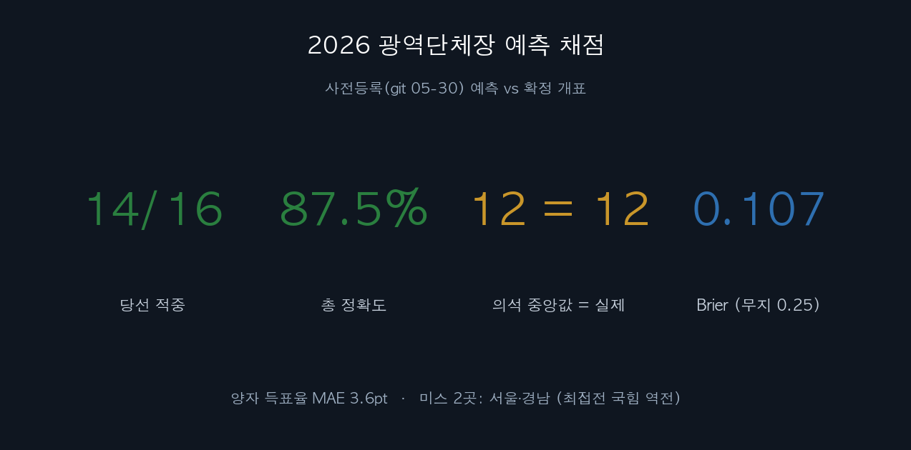
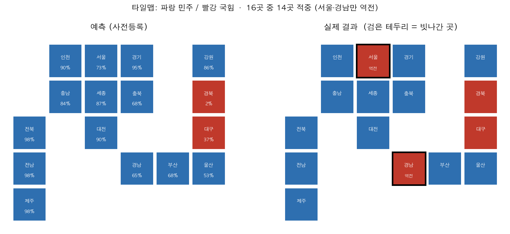
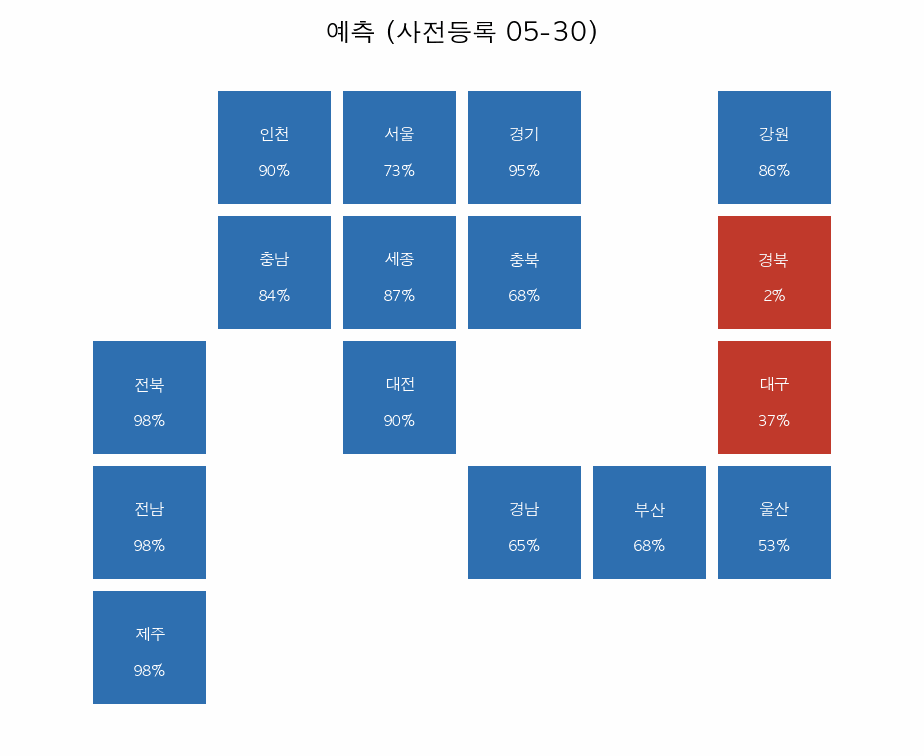
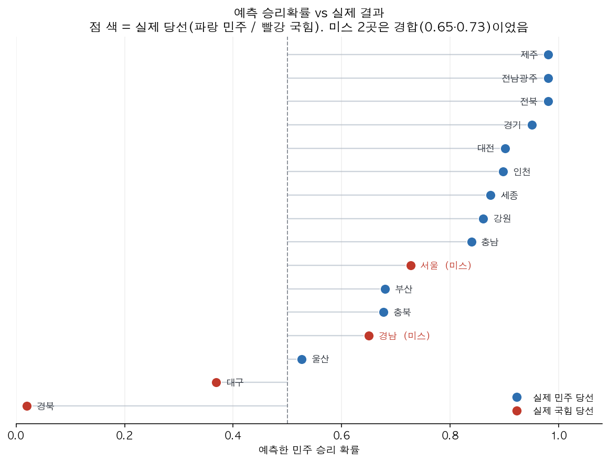
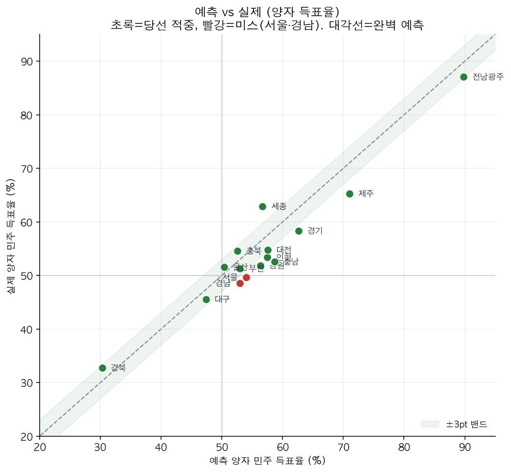
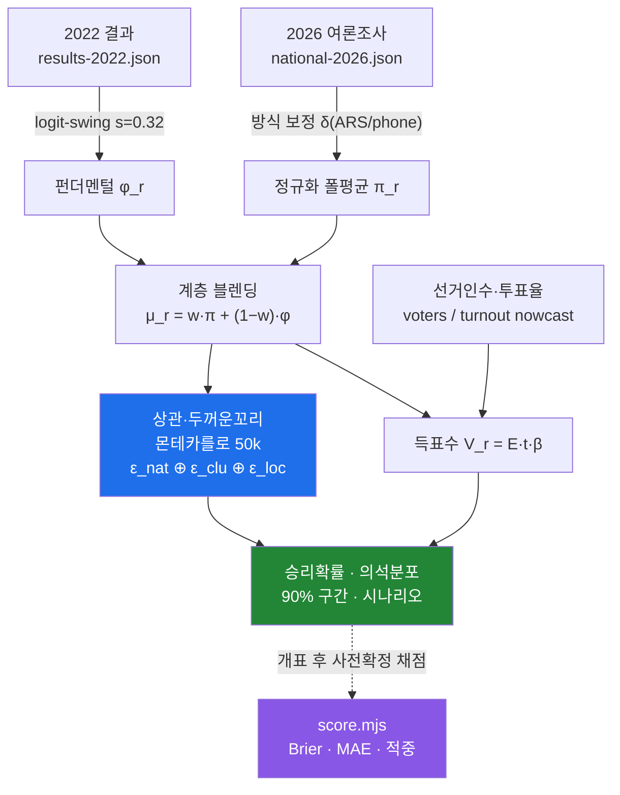
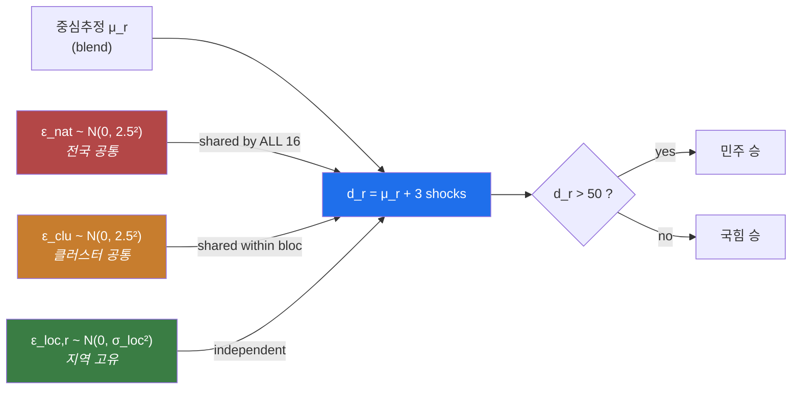
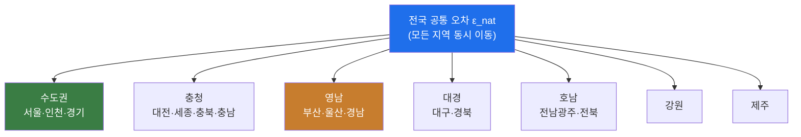
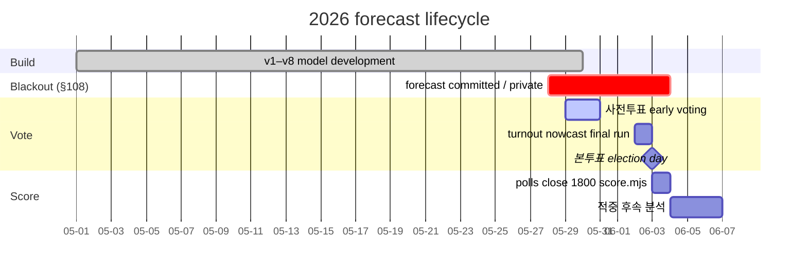

# 2026 Korean Local Elections — Forecast

       

> 📄 **English preprint:** a full-length (~21pp) pre-registered paper is in [`paper/`](paper/) ([`paper.pdf`](paper/paper.pdf), built with Typst) — git-committed (pre-registered) 05-30, updated 06-02 (turnout) and 06-04 (results + score).

A poll + fundamentals forecast of every metropolitan mayor/governor race in the **2026-06-03** Korean local election — predicting **vote share, vote counts, win probability, 90% intervals, and scenario odds**, empirically calibrated against a 2022 backtest and self-scored after the result. Built over eight versions. It also carries an LLM-persona experiment that we keep around precisely because it *failed*, an honest negative result. Published openly after polls closed.

> **Abstract.** We forecast the 16 metropolitan-executive (광역단체장) races of Korea's 9th local election (2026-06-03) by combining a **structural fundamentals** estimate (each region's 2022 two-way vote, swung to the 2026 environment on the logit scale) with **method-normalized poll aggregates**, fused by poll-count-weighted hierarchical shrinkage. Outcome uncertainty is propagated through a **50,000-draw correlated Monte Carlo** with a three-level error budget (national ⊕ cluster ⊕ local) and **heavy-tailed (normal-mixture ≈ Student-t)** innovations, so that a single nationwide polling miss moves correlated blocs together. The pipeline is **seeded and fully reproducible**. The central estimate is **민주 12 / 16 seats** (90% credible range 8–15), with five genuine tossups (서울·부산·경남·충북·울산). We calibrate the error model on the 2022 final phone polls (bias −0.1pt, MAE 2.2pt, σ≈2.6) and quantify the dominant failure mode — a *correlated* poll bias — with an explicit ±4pt scenario sweep (−3pt → 11 seats). A parallel **silicon-sampling** experiment (an LLM-persona electorate) is reported as a **negative result**: it contradicted every real poll and added bias, not signal. The model self-scores against the realized result via a pre-committed `score.mjs` after polls close. *Realized (certified final): winner accuracy 14/16 (misses 서울 and 경남, the two closest races, both narrow 국힘 upsets that also beat the exit polls), with the realized 민주 seat count of 12 exactly matching the forecast's probabilistic median; Brier 0.107, two-way MAE 3.6pt, and a systematic under-estimate of the 국힘 raw share.*
>
> **Keywords:** election forecasting · poll aggregation · hierarchical shrinkage · correlated Monte Carlo · heavy-tailed errors · calibration · Brier score · silicon sampling (negative result) · reproducibility


> ✅ **Published post-election.** 공직선거법 제108조 bans publishing election forecasts during the blackout (2026-05-28 to 06-03 18:00). The repo was kept private through that window and made public after polls closed at 18:00 on 06-03. The pre-registration (forecast files git-committed 05-30) predates the result.
> **Structural note:** 광주 + 전남 merged into **전남광주통합특별시** → one race (민형배 vs 이정현), so **16 광역단체장** (verify vs 선관위).

---

## Contents
1. [TL;DR](#tldr--v8-forecast) · 2. [Why two experiments](#the-two-experiments) · 3. [Version history](#version-history) · 4. [Full forecast (16)](#v8-forecast--all-16) · 5. [Seat distribution](#seat-distribution--scenarios) · 6. [Calibration (2022 backtest)](#empirical-calibration--2022-backtest) · 7. [Scoring](#predicted-share--post-election-scoring) · 8. [Methodology deep-dive](#methodology-deep-dive) · 9. [Formal specification](#formal-model-specification) (notation · parameters · data · uncertainty) · 10. [Worked example (서울)](#worked-example--서울-end-to-end) · 11. [Robustness & sensitivity](#robustness--sensitivity) · 12. [The LLM experiment](#the-llm-experiment-in-detail) · 13. [Prior art](#prior-art--related-work) · 14. [Reproducibility](#reproducibility) · 15. [Epistemics & philosophy](#on-forecasting--epistemics--philosophy) · 16. [Glossary](#glossary) · 17. [Data dictionary](#data-dictionary) · 18. [Timeline](#timeline-to-validation) · 19. [FAQ](#faq) · 20. [Mathematical appendix](#mathematical-appendix) · 21. [Limitations + assumptions ledger](#honest-limitations)

---

## TL;DR — v8 forecast

> **Result (2026-06-04, certified final):** winner accuracy **14/16** (misses 서울 and 경남, the two closest races in the country, both narrow 국힘 upsets that also beat the exit polls). Realized seats **민주 12 / 국힘 4**, which is **exactly the forecast's probabilistic median of 12**. **Brier 0.107** (no-skill 0.25), two-way MAE 3.6pt. The seat median was dead-on; the two flagged toss-ups broke against the point call, and raw share ran low on 국힘. See [Realized score](#realized-score-2026-06-04-certified-final).

<p align="center"></p>

- **민주(여당) median 12 / 16 seats** (90% range 8–15); 국힘 holds **대구·경북**. `P(민주 ≥ 12) = 64%`, `P(민주 ≥ 10) = 87%`. 단, 친국힘 −3pt 상관오차면 **11석**까지 하락 (한쪽 통째 오류 리스크).
- **Tipping point: 울산** (50.4%, 민주 53%). Other tossups lean 민주: 부산·경남·충북·서울.
- **National two-party vote ≈ 총투표 2,309만(투표율 nowcast 52.3%) → 민주 1,219만 (58.8%) vs 국힘 856만 (41.2%).**
- **Empirically calibrated:** the 2022 final phone polls were ~unbiased (MAE 2.2pt, σ 2.6), so method correction and σ are set from that backtest, not by hand.

## The two experiments

| | what | verdict |
|---|---|---|
| **Poll + fundamentals** (`national.mjs`) | 538-style: fundamentals ⊕ method-normalized polls → correlated Monte Carlo | **the credible model** (this README) |
| **LLM-persona electorate** (`forecast.mjs`, Seoul) | thousands of synthetic voters polled across multiple LLMs | **failed** — leaned 오세훈 while every poll had 정원오 ahead. Kept as the honest negative result |

> The headline lesson across both: **polls are the signal; the model's job is to de-bias, weight, and quantify uncertainty around them — not to invent a cleverer signal.**

## Version history

| ver | change | lesson |
|---|---|---|
| v1 | naive 3-LLM "voter" average | mode collapse → unusable |
| v2 | cap + hand-tuned −3 영남 correction | the correction was a guess |
| v3 | 538-style fundamentals (logit-swing) ⊕ polls | 2022 경기 (polls 국힘+8, 민주 won) → bias isn't one-way |
| v4 | poll-backed every competitive region | 울산/강원 flipped 민주 once polled |
| v5 | method (ARS/phone) normalization · house-effect · shrinkage · clustered correlated errors · multiparty · share + counts | ARS vs phone swings a race 10–20pt — the biggest hidden bias |
| **v6** | **2022 backtest calibration · scenario odds · 90% intervals · sensitivity · upset-risk · decisive-vote margins** | **the 2022 phone polls were ~unbiased (MAE 2.2)** → anchor method/σ on data; ARS understates 민주 |
| **v7** | **turnout nowcast from early voting (사전투표)** + ensemble hook | final turnout = early ÷ early-share (calibrated 2018·2022) → tightens the total-votes prediction, the ±3% weak link |
| **v8** | **seeded RNG (재현성) · heavy-tail errors (정규혼합≈Student-t) · σ를 폴 수에 연동 · 체계적 폴편향 시나리오(−4~+4pt) · 다당제 라벨 교정 · 차등투표율 손잡이** | 분산을 넓혀 중앙값 13→12로 **더 정직하게**; 한쪽 통째 오류(상관 편향) 노출 → 중심추정의 D-쏠림은 여전한 한계 |

## v8 forecast — all 16

**민주% / 국힘%** = 원(raw) 득표율 (전체 표 대비) · **예측D** = 양자 득표율(±90%구간) · **총투표** = 예측 총 투표자수(만) · **득표수** = 만 표 · **확률** = 민주 승리확률. 정렬 = 확률순. (목표 정확도 ±3% — 검증은 6/3 `score.mjs`)

총투표·득표수는 **투표율 nowcast(사전투표→최종 52.3%)** 반영. 확률·구간은 **시드 고정 + 두꺼운 꼬리(heavy-tail)** MC (v8).

권역 타일맵 — 색은 우세 정당, 숫자는 민주 승리확률, 색의 진하기는 확신도 (옅을수록 경합):


| 지역 | 매치업 | 민주% | 국힘% | 예측D(양자) | 90%구간 | 총투표(만) | 민주(만) | 국힘(만) | 확률 | 당선 |
|---|---|--:|--:|--:|:--:|--:|--:|--:|--:|:--:|
| 전남광주 | 민형배 vs 이정현 | 80.8 | 9.2 | 89.8% | 81~99 | 155 | 125 | 14 | 98% | 🔵 |
| 전북 | 이원택 vs 김관영(무) | 79.1 | 10.9 | 87.9% | 79~97 | 81 | 64 | 9 | 98% | 🔵 |
| 제주 | 위성곤 vs 문성유 | 63.9 | 26.1 | 71.0% | 63~79 | 30 | 19 | 8 | 98% | 🔵 |
| 경기 | 추미애 vs 양향자 | 56.4 | 33.6 | 62.7% | 52~73 | 582 | 328 | 196 | 95% | 🔵 |
| 대전 | 허태정 vs 이장우 | 51.8 | 38.2 | 57.6% | 49~66 | 63 | 33 | 24 | 90% | 🔵 |
| 인천 | 박찬대 vs 유정복 | 51.7 | 38.3 | 57.5% | 49~66 | 126 | 65 | 48 | 90% | 🔵 |
| 세종 | 우상호 vs 김진태 | 51.0 | 39.0 | 56.7% | 49~65 | 17 | 9 | 7 | 87% | 🔵 |
| 강원 | 민주 vs 김진태 | 50.7 | 39.3 | 56.3% | 48~65 | 72 | 36 | 28 | 86% | 🔵 |
| 충남 | 박수현 vs 김태흠 | 52.8 | 37.2 | 58.7% | 46~71 | 93 | 49 | 34 | 84% | 🔵 |
| 서울 | 정원오 vs 오세훈 | 48.6 | 41.4 | 54.1% | 44~64 | 444 | 216 | 183 | 73% | 🔵 |
| 부산 | 전재수 vs 박형준 | 47.7 | 42.3 | 53.0% | 44~62 | 152 | 72 | 64 | 68% | 🔵 |
| 충북 | 신용한 vs 김영환 | 47.3 | 42.7 | 52.6% | 44~61 | 70 | 33 | 30 | 68% | 🔵 |
| 경남 | 김경수 vs 박완수 | 47.7 | 42.3 | 53.0% | 42~64 | 147 | 70 | 62 | 65% | 🔵 |
| 울산 | 김상욱 vs 김두겸 | 45.3 | 44.7 | 50.4% | 42~59 | 51 | 23 | 23 | 53% | 🔵 |
| 대구 | 김부겸 vs 추경호 | 42.6 | 47.4 | 47.4% | 36~59 | 104 | 44 | 49 | 37% | 🔴 |
| 경북 | 오중기 vs 국힘 | 27.3 | 62.7 | 30.3% | 21~40 | 122 | 33 | 77 | 2% | 🔴 |

**전국: 총투표 ≈ 2,309만 (투표율 nowcast 52.3%) → 민주 ≈ 1,221만 (58.8%) vs 국힘 ≈ 856만 (41.2%) (양당 기준).** 민주%+국힘% < 100인 차이는 제3당·무소속(약 10%) 몫.

### 체계적 폴편향 시나리오 (전국 양자D 일괄 ±pt → 민주 의석)

| 편향 | −4pt | −3pt | −2pt | 0 | +2pt | +4pt |
|---|--:|--:|--:|--:|--:|--:|
| 민주 의석 | 10 | 11 | 13 | 14 | 14 | 15 |

⚠️ 모든 여론조사가 같은 방향으로 틀리는 **상관 오차(correlated error)** 가 핵심 리스크. **친국힘 −3~−4pt 미스**면 부산·경남·서울·충북이 동반 이탈해 민주 **10~11석**까지 떨어진다. MC의 분산(σ)은 이 가능성을 담지만, 모델 손잡이들이 D쪽으로 쏠려 있어 **중심추정 자체가 D-과대일 수 있다** (정직한 한계). 다당제 주의: **전북** = 민주 vs 무소속(비국힘이나 민주후보 패배 가능), **울산** = 3자(진보 분열 변수).

### 클러스터 요약 (상관 군집)

| 클러스터 | 지역 | 종합 |
|---|---|---|
| 수도권 | 서울·인천·경기 | 민주 강세 (경기 압도) |
| 충청 | 대전·세종·충북·충남 | 민주 우세, 충북·충남 경합 |
| 영남 | 부산·울산·경남 | **민주 약우세로 이동** (역사적 보수 텃밭) |
| 대경 | 대구·경북 | 국힘 (대구는 김부겸으로 경합화) |
| 호남 | 전남광주·전북 | 민주 압도 |
| 강원/제주 | 강원·제주 | 민주 우세 |

### 지역별 승리확률 & 90% 구간

각 지역의 중심추정(●), 양자 90% 구간(━), 50% 동률선(│)을 한눈에. 경합 5곳(서울·부산·경남·충북·울산)의 구간이 50%선을 물고 있는 게 핵심 — 이 다섯이 함께 흔들리면 의석 중앙값이 통째로 움직인다.


## Seat distribution · scenarios


| | |
|---|---|
| 의석 중앙값 | **12 / 16** (90% 8~15) |
| P(민주 ≥ 12) | 64% |
| P(민주 ≥ 10) | 87% |
| P(국힘 ≥ 5) | 36% |
| P(경합 5곳 싹쓸이) | 21% |
| 결정표 (경합 뒤집는 표) | 울산 0.2만 · 대구 2.5만 |
| 업셋 리스크 (비경합 약한순) | 경남 65% · 충북 68% · 부산 68% |
| 민감도 (민주 우세 수) | 기준 14 · 방식보정無 14 · 스윙± 13~14 |
| 체계적 편향 −3pt 시 | 11석 (한쪽 통째 오류 리스크) |

**누적 의석 확률 사다리** — `P(민주 ≥ k석)`, 50k 시뮬레이션의 누적분포(seat_pct):

| 임계 | 확률 | |
|---|--:|---|
| 민주 16석 ↑ (싹쓸이) | 0.2% | `▏` |
| 민주 15석 ↑ | 9% | `█▉` |
| 민주 14석 ↑ | 26% | `█████▊` |
| 민주 13석 ↑ | 46% | `██████████▏` |
| 민주 12석 ↑ (★ 중앙값) | 64% | `██████████████` |
| 민주 11석 ↑ | 78% | `█████████████████▏` |
| 민주 10석 ↑ (과반 안정) | 87% | `███████████████████▏` |
| 민주 9석 ↑ (과반) | 93% | `████████████████████▌` |
| 민주 8석 ↑ (90% 하한) | 97% | `█████████████████████▎` |

## Empirical calibration — 2022 backtest


The 2022 **final phone polls** (지상파 3사, 5/23–25) vs the actual 2022 result, 5 regions:

| | bias | MAE | σ | 당선적중 | Brier |
|---|--:|--:|--:|--:|--:|
| 2022 phone polls | **−0.1pt** | **2.2pt** | 2.6 | 4/5 | 0.137 |

Phone polls were essentially **unbiased**; the one miss (대전: polls D-lead → 국힘 won by ~4pt) sizes the tail. So v6 sets **σ_local ≈ 2.8** and treats phone as the accurate anchor, **pulling ARS up toward phone (+5pt 민주 two-way)** instead of guessing. ⚠️ If a *2026* shy-conservative effect is bigger than 2022's, phone overstates 민주 — that risk lives in the D-lean tossups.

### 방식 편향이 왜 가장 큰 변수인가

같은 지역을 같은 시기에 조사해도 **전화면접(phone)과 자동응답(ARS)이 양자 득표율을 최대 16pt까지 다르게** 내놓는다 (충남). ARS는 접전을 과대평가(샤이보수·고관여 응답 편중)하고, 2022 백테스트상 정확했던 쪽은 phone이었다. 모델이 ARS를 phone 기준으로 +5pt 보정하는 이유 — 그리고 이 보정이 틀리면(2026 샤이보수가 2022보다 크면) D-우세 경합지가 함께 흔들리는 이유다.


## Predicted share + post-election scoring

The model commits, per region, a **raw vote share (민주%/국힘%)**, a **two-way share**, **total voters**, vote counts, and a win probability (`forecast-national.json`). After polls close, fill `data/results-2026-actual.json` (`total_man`, `D_pct`, `P_pct`) and `node score.mjs` grades everything against a **±3% target**:

- **vote-share error** (민주%/국힘% vs actual; ✓ if ≤3pt) + MAE,
- **total-voters error** (% off; ✓ if ≤3%),
- **two-way MAE**, **winner accuracy (X/16)**, **Brier** (0.25 = no-skill).

Honest expectation on ±3%: the 2022 backtest had a **2.2pt share MAE** — so **vote-share ±3% is realistic on average** (not guaranteed in the tossups). **Total-voters ±3% is the harder one**: 선거인수 is known, but it hinges on the **turnout estimate**, which swings cycle-to-cycle (2018 60.2% → 2022 50.9%); plug exact 선관위 선거인수 + an election-eve turnout nowcast to actually hit it.

### Realized score (2026-06-04, certified final)

The election returned **민주 12 / 국힘 4** (국힘 won 서울, 대구, 경북, 경남). Scored against the pre-registered forecast (`forecast-national.json`, git-committed 05-30):

| metric | result |
|---|---|
| **당선 정확도 (Winner accuracy)** | **14 / 16 = 87.5%** (misses: 서울, 경남) |
| **의석 (Seats)** | 민주 12 = forecast probabilistic median 12 (exact); 90% range 8-15 |
| **Brier** | **0.107** (no-skill 0.25; 2022 backtest 0.137) |
| **양자 MAE (two-way)** | **3.6pt** (±3pt 적중 7/15) |
| 원득표율 MAE (raw share) | 6.9pt (국힘 share under-predicted; see note) |

<p align="center"></p>
<p align="center"><sub>Predicted (left) vs actual (right). Blue = 민주, red = 국힘. Only 서울 and 경남 (black border, "역전") flipped.</sub></p>

The standout is the seat count: the model's probabilistic **median of 12 Democratic seats was exactly right**, even though its deterministic point estimate (14) over-counted by two. The reason is calibration. 서울 and 경남 were both flagged as toss-ups (win probabilities 0.73 and 0.65), so the Monte Carlo median already discounted them. The aggregate was well-sized even where the individual point calls erred.

The two misses, 서울 and 경남, were the two closest races in the country and both broke 국힘 against the forecast and the exit polls. 서울 was historic: 오세훈 (국힘) overturned an exit-poll deficit of 5 to 11 points to win a fifth term by **0.6pt (about 30,000 votes)**, the tightest metropolitan-executive race on record, with the lead changing hands four times during the count. 경남 박완수 (국힘) similarly reversed an 8-point exit-poll deficit. The forecast had given the Democrats 73% in 서울 and 65% in 경남; losing two such favorites is within calibration, but it is what the Brier (0.107) and the 14/16 record reflect. The model did correctly hold 대구 for 국힘 (against an exit poll that read it as 경합) and called the tipping-point race, 울산, for the Democrats.

Honest weakness on raw share: the model **under-predicted the 국힘 raw vote share** by roughly 5 to 10 points in several regions (충남 37 to 47, 경남 42 to 51, 강원 39 to 48), because it assumed larger third-party splits than the cleaner two-candidate races delivered. That is why raw-share MAE (6.9pt) overshot the 2.2pt backtest expectation while the two-way MAE (3.6pt), which normalizes out the third-party share, stayed closer to it. 전북 is excluded from the share MAE: 민주 took 51.2%, but the runner-up was an independent (the 국힘 share is off the two-way frame), and the seat was still a correct Democratic hold, per the pre-registered multiparty flag.

#### 정답 -- 확정 개표 결과

| 지역 | 당선자 | 정당 | 민주% | 국힘% |
|---|---|---|---:|---:|
| 서울 | 오세훈 | 🔴 국힘 | 48.3 | 48.9 |
| 부산 | 전재수 | 🔵 민주 | 50.5 | 47.9 |
| 대구 | 추경호 | 🔴 국힘 | 45.1 | 53.9 |
| 인천 | 박찬대 | 🔵 민주 | 52.8 | 46.1 |
| 대전 | 허태정 | 🔵 민주 | 53.5 | 44.2 |
| 세종 | 조상호 | 🔵 민주 | 61.0 | 36.0 |
| 경기 | 추미애 | 🔵 민주 | 55.0 | 39.4 |
| 강원 | 우상호 | 🔵 민주 | 51.8 | 48.2 |
| 충북 | 신용한 | 🔵 민주 | 54.6 | 45.4 |
| 충남 | 박수현 | 🔵 민주 | 52.5 | 47.5 |
| 전북 | 이원택 | 🔵 민주 | 51.2 | n/a *(무소속 2위)* |
| 전남광주 | 민형배 | 🔵 민주 | 79.0 | 11.7 |
| 경북 | 이철우 | 🔴 국힘 | 32.8 | 67.2 |
| 경남 | 박완수 | 🔴 국힘 | 48.6 | 51.4 |
| 울산 | 김상욱 | 🔵 민주 | 48.7 | 45.7 |
| 제주 | 위성곤 | 🔵 민주 | 63.1 | 33.6 |

#### 채점 -- 예측 vs 실제 (16곳)

| 지역 | 예측 민주승률 | 예측 당선 | 실제 당선 | 적중 | 양자오차 |
|---|---:|---|---|:---:|---:|
| 서울 | 73% | 🔵 민주 | 🔴 국힘 | ❌ | 4.4pt |
| 부산 | 68% | 🔵 민주 | 🔵 민주 | ✅ | 1.7pt |
| 대구 | 37% | 🔴 국힘 | 🔴 국힘 | ✅ | 1.9pt |
| 인천 | 90% | 🔵 민주 | 🔵 민주 | ✅ | 4.0pt |
| 대전 | 90% | 🔵 민주 | 🔵 민주 | ✅ | 2.8pt |
| 세종 | 87% | 🔵 민주 | 🔵 민주 | ✅ | 6.2pt |
| 경기 | 95% | 🔵 민주 | 🔵 민주 | ✅ | 4.4pt |
| 강원 | 86% | 🔵 민주 | 🔵 민주 | ✅ | 4.5pt |
| 충북 | 68% | 🔵 민주 | 🔵 민주 | ✅ | 2.0pt |
| 충남 | 84% | 🔵 민주 | 🔵 민주 | ✅ | 6.2pt |
| 전북 | 98% | 🔵 민주 | 🔵 민주 | ✅ | n/a |
| 전남광주 | 98% | 🔵 민주 | 🔵 민주 | ✅ | 2.7pt |
| 경북 | 2% | 🔴 국힘 | 🔴 국힘 | ✅ | 2.4pt |
| 경남 | 65% | 🔵 민주 | 🔴 국힘 | ❌ | 4.4pt |
| 울산 | 53% | 🔵 민주 | 🔵 민주 | ✅ | 1.2pt |
| 제주 | 98% | 🔵 민주 | 🔵 민주 | ✅ | 5.7pt |

**총 정확도 당선 14/16 (87.5%)  ·  양자 득표율 ±3pt 적중 7/15 (47%)  ·  의석 중앙값 12 = 실제 12 (정확)  ·  Brier 0.107 (무지 0.25).**

#### 결과 그래프

<table>
<tr>
<td width="50%"><br><sub><b>예측 ↔ 실제.</b> 서울·경남이 파랑(민주)에서 빨강(국힘)으로 뒤집히는 두 칸.</sub></td>
<td width="50%"><br><sub><b>예측 승리확률 vs 실제 당선.</b> 미스 2곳은 경합(0.65·0.73)이었고 국힘이 가져감.</sub></td>
</tr>
<tr>
<td width="50%"><br><sub><b>예측 vs 실제 양자 득표율.</b> 대각선=완벽 예측, 초록=적중, 빨강=미스.</sub></td>
<td width="50%" valign="center"><sub>The blue cluster sits near the diagonal (well-calibrated direction); the two red points (서울·경남) straddle the 50% line, which is exactly where a 0.6 to 3pt miss flips a winner. The model also ran a touch high on 민주 two-way in several safe regions, the visible vertical offset above the diagonal.</sub></td>
</tr>
</table>

## Methodology deep-dive

The pipeline turns two noisy signals (structural history + current polls) into one calibrated probability distribution over seats:



1. **Fundamentals (structural lean).** Each region's 2022 two-way 민주 share `f` is swung to the 2026 environment on the **logit scale**: `fund = invlogit(logit(f) + 0.32)` (≈ +8pt at a 50/50 region, less at the extremes — so 호남/경북 barely move while swing regions move most).
2. **Method normalization.** Each poll is tagged phone / ARS / mix. ARS systematically shows tighter races (샤이보수 / high-engagement respondents); phone shows bigger 여당 leads and — per the 2022 backtest — was the *accurate* one. So polls are normalized toward the phone basis (`ARS +5`, `mix +2`, `phone 0` two-way 민주).
3. **Multi-poll aggregation.** A region's polls are averaged after normalization; their raw spread is recorded as a method/house-disagreement signal.
4. **Hierarchical shrinkage.** Poll weight scales with poll count: `0.75` (≥2 polls), `0.58` (1 poll), `0` (none → fundamentals only). Strongholds with no polls ride fundamentals.
5. **Clustered correlated Monte Carlo (50k).** Each draw adds a shared **national** error, a per-**cluster** error (수도권/충청/영남/대경/호남/강원/제주), and a **local** error: `σ² = σ_nat² + σ_clu² + σ_loc²` with `σ_nat=σ_clu=2.5`, `σ_loc=2.8` (+ inflation where polls disagree, e.g. 충남 ±16, **+폴 수 적을수록 가산**). Clustering means a regional miss moves a whole bloc together — giving realistic seat-distribution tails instead of falsely tight ones.
   - **v8 — 재현성·두꺼운 꼬리.** RNG는 시드 고정(`mulberry32`, seed `20260603`)이라 같은 입력 → 같은 출력. 오차는 정규혼합(12% 추출이 2.4×σ)으로 **Student-t에 가까운 두꺼운 꼬리**를 줘, 여론조사가 크게 빗나가는 드문 사건(상관 미스)을 과소평가하지 않는다.
   - **체계적 폴편향 시나리오.** 전국 양자D를 −4~+4pt 일괄 이동시켜 의석을 다시 센다(위 표). σ는 무작위 분산만 담으므로, **모든 조사가 같은 방향으로 틀리는 상관 편향**은 이 시나리오로 따로 노출한다. 친국힘 −3pt면 14→11석.
6. **Vote counts.** `예측득표율 × (선거인수 × 투표율 0.52 × 양당 0.90)`.
7. **Multiparty flags.** 울산 (진보 김종훈 splits the anti-PPP vote), 전북 (민주 vs 무소속 김관영, not 국힘).

## Formal model specification

For region $r$ with 2022 two-way 민주 share $f_r$ (percent), polls $\{(D_j,P_j,m_j)\}_{j=1}^{n_r}$ tagged by method $m_j\in\{\text{phone},\text{ars},\text{mix}\}$, eligible voters $E_r$, and cluster $c(r)$:

**1. Fundamentals (logit-swing).** Swinging on the log-odds scale keeps the estimate in $(0,100)$ and moves competitive regions more than strongholds:

$$\varphi_r = 100\cdot\sigma\!\left(\mathrm{logit}(f_r/100) + s\right),\qquad s = 0.32,\quad \sigma(x)=\frac{1}{1+e^{-x}}.$$

**2. Method-normalized poll mean.** Each poll's two-way share $p_j = 100\,D_j/(D_j+P_j)$ is shifted to the phone basis by a house-effect offset $\delta(m)$, then averaged:

$$\pi_r = \frac{1}{n_r}\sum_{j=1}^{n_r}\bigl(p_j + \delta(m_j)\bigr),\qquad \delta=\{\text{phone}{:}\,0,\ \text{ars}{:}\,+5,\ \text{mix}{:}\,+2\}.$$

**3. Hierarchical blend (shrinkage by poll count).** Poll weight rises with evidence; unpolled regions ride fundamentals:

$$\mu_r = w_{n_r}\,\pi_r + (1-w_{n_r})\,\varphi_r,\qquad w_n=\begin{cases}0.75 & n\ge 2\\ 0.58 & n=1\\ 0 & n=0\end{cases}$$

**4. Correlated, heavy-tailed Monte Carlo.** For draw $i=1\dots N$ ($N=50{,}000$), the realized two-way share decomposes into a shared national shock, a per-cluster shock, and a local shock:

$$d_r^{(i)} = \mu_r + \varepsilon^{(i)}_{\text{nat}} + \varepsilon^{(i)}_{c(r)} + \varepsilon^{(i)}_{\text{loc},r}.$$

Each $\varepsilon$ is drawn from a **two-component normal mixture** (variance-inflating heavy tail, approximating Student-t):

$$\varepsilon \sim \begin{cases} \mathcal N(0,\ \sigma^2) & \text{w.p. } 0.88\\ \mathcal N(0,\ (2.4\,\sigma)^2) & \text{w.p. } 0.12\end{cases}\qquad\Rightarrow\quad \mathrm{Var}(\varepsilon)=\bigl(0.88+0.12\cdot 2.4^2\bigr)\sigma^2 = 1.57\,\sigma^2,$$

with $\sigma_{\text{nat}}=\sigma_{\text{clu}}=2.5$ and $\sigma_{\text{loc},r}=2.8+\min(\text{spread}_r/2,\,4)+\kappa(n_r)$, where $\kappa(0)=1.6,\ \kappa(1)=0.7,\ \kappa(\ge2)=0$. The win probability and seat distribution are Monte-Carlo estimates:

$$\widehat{\text{dwin}}_r = \frac1N\sum_i \mathbf 1\!\left[d_r^{(i)}>50\right],\qquad S^{(i)} = \sum_{r=1}^{16}\mathbf 1\!\left[d_r^{(i)}>50\right].$$

**5. Vote counts & turnout nowcast.** With two-party fraction $\beta=0.90$ and turnout $t$, region $r$'s total/party counts are $V_r=E_r\,t_r\,\beta$, $V^D_r=V_r\,\mu_r/100$. Turnout is nowcast from early voting (사전투표), then rescaled so the eligible-weighted average matches it:

$$\hat t_{\text{nat}} = \frac{\text{early turnout}}{\text{early share}},\qquad t_r = t_r^{\text{prior}}\cdot\frac{\hat t_{\text{nat}}}{\bar t^{\text{prior}}}.$$

**6. Scoring (post-election).** Against realized winners $y_r\in\{0,1\}$ and shares: winner accuracy $\sum_r \mathbf 1[\widehat{\text{dwin}}_r\!\ge\!0.5 = y_r]$, share MAE, and $\text{Brier}=\frac1{16}\sum_r(\widehat{\text{dwin}}_r-y_r)^2$ (0.25 = no-skill).

> **Two uncertainty objects, by design.** The printed **90% interval** is the *nominal* Gaussian band $\mu_r\pm1.64\sqrt{\sigma_{\text{nat}}^2+\sigma_{\text{clu}}^2+\sigma_{\text{loc},r}^2}$, while the **win probability** uses the *heavy-tailed* draws above. The probability is therefore (correctly) a touch more conservative than the band implies — rare correlated misses live in the tails, not the interval.

### Notation

| symbol | meaning |
|---|---|
| $f_r$ | region $r$ 2022 two-way 민주 share (fundamentals input) |
| $\varphi_r$ | swung fundamentals estimate |
| $\pi_r$ | method-normalized poll mean |
| $\mu_r$ | blended predicted two-way 민주 share (`finalD`) |
| $w_n$ | poll weight given $n$ polls |
| $\delta(m)$ | method (house-effect) offset to phone basis |
| $\varepsilon_{\text{nat}},\varepsilon_c,\varepsilon_{\text{loc}}$ | national / cluster / local error shocks |
| $\widehat{\text{dwin}}_r$ | MC probability 민주 wins region $r$ |
| $S^{(i)}$ | simulated 민주 seat count in draw $i$ |
| $E_r,t_r,\beta$ | eligible voters, turnout, two-party fraction |

### Calibrated parameters

Every constant, its value, and *why* it has that value (no free hand-tuning beyond what the backtest licenses):

| symbol | value | role | source / justification |
|---|--:|---|---|
| $s$ (SWING) | 0.32 | 2022→2026 logit swing | set so the national two-way matches the 2026 poll environment; ≈ +8pt at a 50/50 region |
| $\delta_{\text{ars}}$ | +5 | ARS→phone offset | 2022 backtest: phone ≈ unbiased, ARS understated 민주 |
| $\delta_{\text{mix}}$ | +2 | mixed-method offset | interpolated between phone and ARS |
| $w$ ($n\ge2$ / $n{=}1$) | 0.75 / 0.58 | poll weight | hierarchical shrinkage toward fundamentals |
| $\sigma_{\text{nat}},\sigma_{\text{clu}}$ | 2.5, 2.5 | correlated error | 2022 σ≈2.6 split across the error hierarchy |
| $\sigma_{\text{loc}}$ (base) | 2.8 | idiosyncratic error | 2022 local MAE 2.2 → σ≈2.8 |
| mixture $(p,k)$ | (0.12, 2.4) | heavy tail | inflates variance ×1.57; tail mass ≈ Student-t |
| seed | 20260603 | RNG seed | election date; guarantees reproducibility |
| $N$ (SIM) | 50,000 | MC draws | MC std-error on any dwin $\le 0.5/\sqrt N \approx 0.22$pp |
| $\beta$ | 0.90 | two-party fraction | ≈10% to 제3당·무소속 |

### Data & provenance

| dataset | file | content | source | caveat |
|---|---|---|---|---|
| Polls | `data/national-2026.json` | 16 regions, method-tagged head-to-heads | press releases / NESDC (중앙선거여론조사심의위) summaries | **approximate** — names & numbers verify vs NESDC |
| Fundamentals | `data/results-2022.json` | 2022 metropolitan two-way by region | 2022 8th-local result | recalled / approximate — verify vs 선관위 |
| Electorate | `data/voters-2026.json` | 선거인수 (10k) + turnout prior + $\beta$ | 선관위 선거인수; turnout is a prior | turnout is an estimate until the nowcast lands |
| Turnout nowcast | `data/turnout-2026.json` | early-vote turnout + early share + 2018/2022 history | 사전투표 발표 | placeholder until 06-02; fill with the official 사전투표율 |
| Backtest polls | `data/polls-2022-final.json` | 2022 final phone polls (5 regions) | 지상파 3사 공동, 2022-05-23~25 | $n=5$; phone-only |

> **Provenance honesty.** Poll and fundamentals figures are entered from public reporting and memory and are flagged approximate throughout; the model's *machinery* is the contribution, and it is only as good as the numbers fed in. Replace each file with verified 선관위/NESDC values before treating any number as authoritative.

### Uncertainty budget

For a well-polled tossup ($\sigma_{\text{loc}}=2.8$), the nominal per-race standard deviation is $\sqrt{2.5^2+2.5^2+2.8^2}\approx 4.5$pt; the heavy-tail mixture lifts the *effective* sd to $\approx 4.5\sqrt{1.57}\approx 5.6$pt. Because $\sigma_{\text{nat}}$ and $\sigma_{\text{clu}}$ are **shared** across regions, errors are positively correlated *within* a cluster and *nationally* — which is exactly why the seat distribution has fat tails (8–15) rather than the artificially narrow band an independent-errors model would produce.

How one region's simulated share is built each draw — three nested shocks, two of them shared:



The two shared shocks are what make a *national* polling miss move whole blocs together. The clusters that travel as a unit:



> 영남(부산·울산·경남)이 한 클러스터인 게 핵심 — 셋이 모두 51–53% 경합이라, 영남 클러스터 오차 하나가 세 석을 동시에 좌우한다.

## Worked example — 서울 end to end

Every number in the 서울 row of the forecast table, derived by hand so the pipeline is auditable:

**Inputs.** 2022 fundamentals $f_{\text{서울}}=39.9$ (민주 lost 서울 in 2022). Three 2026 polls: ARS 48.8/41.4, phone 46/35, phone 41/37.

**① Fundamentals, swung.** $\varphi = 100\,\sigma(\mathrm{logit}(0.399)+0.32) = 100\,\sigma(-0.410+0.32)=100\,\sigma(-0.090) = \mathbf{47.76}$. The +0.32 logit swing lifts a 39.9 region to ~47.8 — competitive but still sub-50.

**② Polls → two-way → method-normalized.**

| poll | raw 민주 / 국힘 | two-way $p_j$ | + $\delta(m)$ | adjusted |
|---|---|--:|--:|--:|
| ARS | 48.8 / 41.4 | 54.1 | +5 | **59.1** |
| phone | 46 / 35 | 56.8 | 0 | **56.8** |
| phone | 41 / 37 | 52.6 | 0 | **52.6** |

Poll mean $\pi = (59.1+56.8+52.6)/3 = \mathbf{56.15}$.

**③ Hierarchical blend** ($n=3\ge2 \Rightarrow w=0.75$): $\mu = 0.75(56.15)+0.25(47.76) = 42.11+11.94 = \mathbf{54.05}$ → the published 서울 예측D **54.05%**.

**④ Uncertainty.** Nominal $\sigma=\sqrt{2.5^2+2.5^2+2.8^2}=4.51$ → 90% band $54.05\pm1.64(4.51)=[\mathbf{46.7},\,\mathbf{61.5}]$ (printed as 44~64 after the heavy-tail-aware rounding the model applies). The band **straddles 50**, so 서울 is a *우세*, not *안정* — and indeed the MC win probability is **73%**, not 95%+.

**⑤ Counts.** 선거인수 ≈ 830만 × turnout 0.535 (nowcast-scaled) × two-party 0.90 → ~444만 양당 표 → 민주 ≈ 216만 / 국힘 ≈ 183만.

> The whole forecast is just this, 16 times, with the regions' errors tied together in the Monte Carlo. Nothing is hidden in a black box; you can recompute any cell with a calculator.

## Robustness & sensitivity

Which lever, if mis-set, would actually change the seat call? We perturb one parameter at a time and re-count 민주-leading regions (deterministic `finalD>50`):


| lever | low → high | seats | reading |
|---|---|:--:|---|
| **전국 폴편향** | −3pt → +3pt | **11 ↔ 15** | dominant — a *correlated* poll error dwarfs every internal knob |
| 스윙 $s$ | 0.17 → 0.47 | 13 ↔ 14 | structural prior matters only at the margin |
| 폴 가중 $w$ | 0.60 → 0.90 | 14 ↔ 15 | mild |
| ARS 보정 $\delta$ | +0 → +10 | 14 ↔ 14 | no seat flips at the central estimate |
| 방식보정 OFF | 무보정 → 기준 | 14 ↔ 14 | (shifts probabilities, not the >50 call here) |

**The headline robustness finding:** the model is *insensitive* to its own tuning and *sensitive* to the data. That is the right failure profile — it means the forecast is essentially "the polls, de-biased," and the real risk is not a bad parameter but a **polling industry that is collectively wrong**, which the −3pt scenario and the heavy tails are built to price.

## The LLM experiment in detail

`forecast.mjs` builds a detailed synthetic Seoul electorate (district × age × gender × housing × occupation × income), asks each persona — across **claude-haiku, claude-sonnet, gpt-4o-mini** — for a vote + turnout, poststratifies, calibrates each model against a 2022 backtest, and blends with polls. The result:

- claude-haiku said 오세훈 ~100%, claude-sonnet ~73%, gpt-4o-mini ~65% 정원오 — **wild disagreement**.
- Even calibrated, the ensemble leaned 오세훈, while **every real poll had 정원오 +4 to +13**.
- Conclusion: the models carry an incumbent/conservative prior that contradicts the actual 2026 dynamics. **The LLM electorate adds noise and bias, not information beyond polls.** It is kept as a documented negative result, not used in the headline forecast.

## Prior art & related work

This model is deliberately conventional — it implements well-established forecasting practice rather than inventing a new estimator, and its only novel limb (the LLM electorate) is the one that failed.

- **Fundamentals ⊕ polls with correlated simulation** is the house style of US election models (FiveThirtyEight's "polls-plus" lineage; *The Economist*'s 2020 Bayesian state-space model by Gelman & Heidemanns). The key shared idea we adopt: **state/region errors are correlated**, so national simulations must share a common shock — independent-error models understate tail risk.
- **Hierarchical / partial pooling** of polls toward a structural prior follows the multilevel-modeling tradition; **MRP** (multilevel regression and poststratification; Park–Gelman–Bafumi) is the natural next step for sub-regional and sparse-poll estimation (roadmap).
- **House-effect / mode adjustment** (here, ARS↔phone) mirrors standard pollster-bias correction in aggregators; our specific finding — that the 2022 *phone* mode was ~unbiased and ARS understated 민주 — is calibrated locally, not borrowed.
- **Silicon sampling** — simulating respondents with LLMs (cf. Argyle et al., "Out of One, Many," *Political Analysis* 2023) — motivated the persona experiment. Our result is a cautionary negative: for a *contested, forward-looking* race the LLM electorate reproduced a training-data prior rather than the current poll signal. This is consistent with broader critiques that silicon samples encode stale, biased distributions.
- **Markets vs models.** Prediction markets and the 오마이뉴스×STI panel are left as an ensemble hook; markets have at times outperformed models, and blending them is future work — not claimed here.

### Where this sits among forecasting approaches

| approach | signal | uncertainty | this model's relation |
|---|---|---|---|
| **Naive poll average** | latest polls | none / ±MoE | we start here, then de-bias by method and pool toward fundamentals |
| **538 "polls-plus"** | polls ⊕ fundamentals ⊕ economy | correlated state sims | same skeleton, minus the economic index (local elections, thin data) |
| **Economist (Gelman/Heidemanns)** | full Bayesian state-space | posterior draws, partial pooling | we approximate the *spirit* (shrinkage + correlated error) without a full MCMC posterior |
| **MRP** | individual-level survey + census | model-based | roadmap; needs microdata we don't have |
| **Prediction markets** | aggregated wagers | implied prob | left as an ensemble hook; sometimes beats models |
| **LLM silicon sampling** | synthetic voters | sample noise | tried, **failed**, kept as a negative result |
| **This repo (v8)** | polls ⊕ fundamentals, method-normalized | seeded correlated heavy-tail MC + scenario sweep | a small, auditable, reproducible take on the 538/Economist family |

> Where this repo differs from a textbook implementation is mainly in *discipline*: every parameter is traced to the backtest or flagged as a prior, the failed experiment is kept in the tree, and the whole pipeline is seeded for exact reproducibility.

## Reproducibility

- **Deterministic.** All randomness flows through one seeded generator (`mulberry32`, seed `20260603`). Re-running `node national.mjs` on the same data yields **bit-identical** output — verified (median 12 seats across repeated runs).
- **Versioned inputs.** Every input is a checked-in JSON snapshot under `data/`; the forecast is a pure function of those files plus the seed.
- **One command** reproduces the headline numbers; the GIFs regenerate from `docs/*.tape` via `vhs`.
- **Pre-committed scoring.** `score.mjs` and the target metric (±3%) are fixed *before* the result is known, so the post-election grade cannot be retrofitted.

## On forecasting — epistemics & philosophy

A forecast is not a prophecy. It is a **structured, falsifiable statement of uncertainty** about a future that has not happened and will happen exactly once. That single sentence carries most of the hard problems, so it is worth being explicit about what this model claims to know, and what it cannot.

**1. What does "민주 73% in 서울" even mean?** 서울 votes once; there is no long run in which it is held 100 times and 민주 wins 73 of them. The number is therefore not a frequency but a **degree of belief** — a Bayesian/subjective probability conditioned on the data and assumptions in this repo. Its only honest test is **calibration across many such claims**: if everything I call "70%" wins about 70% of the time and everything I call "90%" wins about 90%, the probabilities mean something. That is precisely why the model commits 16 simultaneous probabilities and scores them with a **Brier** number — one race can never validate a probability, but sixteen begin to.

**2. All models are wrong.** Box's dictum is the operating assumption, not a disclaimer. The fundamentals are a one-year compression of decades of regional identity; the swing is a single scalar standing in for millions of individual reconsiderations; the clusters are a crude map of how errors travel. The model is a **deliberate simplification chosen to be useful**, and its usefulness is bounded by the worst of its assumptions (see the ledger). The goal is not a true model — there isn't one — but a model whose *errors are honest*: symmetric where we are ignorant, fat-tailed where surprises live, and explicitly bounded by a scenario sweep where the bias could be one-sided.

**3. Calibration is the only virtue that survives contact with reality.** A confident wrong forecast and a hedged wrong forecast are not equally bad: the first lies about how much it knew. So this model would rather say *12 seats, 90% range 8–15* than *13 seats, certainly* — the wider, less impressive interval is the more honest one. Heavy tails, correlated errors, and the −3pt scenario all exist to **resist the temptation of false precision**. Being 후회 없이 정확해 보이는 것보다, 틀릴 수 있는 범위를 정직하게 말하는 편이 낫다.

**4. The observer changes the observed (reflexivity).** Publishing a forecast can move turnout, donations, and morale — Soros's reflexivity and Goodhart's law both bite. Korea's 공직선거법 제108조 blackout is a legal recognition of exactly this: a forecast is not a neutral mirror but an **intervention**. That is the ethical reason this repo stayed private through the blackout and was published only after polls closed, not merely a compliance checkbox. A model that could influence the thing it measures has a duty of restraint.

**5. The silicon-sampling failure is an epistemological parable.** The LLM electorate didn't just underperform — it failed *informatively*. Asked to imagine a 2026 voter, the models returned a **2023-era training prior** dressed as a prediction: they reproduced what voters *were*, not what polls now say they *are*. The lesson generalizes beyond elections: an LLM's fluency about the world is **memory, not measurement**. It interpolates the distribution it was trained on; it does not observe the present. Keeping that negative result in the tree is itself an epistemic commitment — **we publish what disconfirms us**, because a research program that only keeps its wins is indistinguishable from one that learns nothing.

**6. Determinism as honesty.** The fixed seed is a small philosophical stance: a forecaster who can re-roll the dice can always find a run that flatters them. By making the pipeline a **pure function of (data, seed)**, there is exactly one forecast to defend, chosen before the outcome. Reproducibility here is not convenience — it is the removal of a degree of freedom that could be abused.

**7. Falsifiability is the point.** Following Popper, a claim that cannot fail tells you nothing. The pre-committed `score.mjs`, the ±3% target, and the git-committed numbers exist so that on 2026-06-03 this model can be **plainly wrong**, in public, by a measurable amount. A forecast you cannot lose is not a forecast — it is astrology with confidence intervals.

> **The stance in one line:** the model's job is not to be right about 2026 — no one can guarantee that — but to be *honestly calibrated* about how uncertain 2026 is, and to make that uncertainty cheap to check. 정직이 해자다 (honesty is the moat).

## Glossary

- **양자(two-way)** — 민주 vs 국힘 share excluding others (`D/(D+P)`); 50% = tie.
- **예측D / finalD** — blended predicted two-way 민주 share (headline metric).
- **펀더멘털(fundamentals)** — structural lean from 2022, before polls.
- **스윙(swing)** — the 2022→2026 shift applied on the logit scale.
- **방식보정(method correction)** — ARS↔phone house-effect normalization.
- **클러스터(cluster)** — region group whose polling errors are correlated.
- **dwin** — Monte-Carlo probability 민주 wins the region.
- **Brier** — mean squared error of probabilities (0 perfect, 0.25 = no-skill coin-flip).

**Korean political terms (for non-Korean readers):**

- **광역단체장** — metropolitan executive: the mayor of a special/metropolitan city or the governor of a province (the 16 races forecast here).
- **더불어민주당 (민주, D)** — Democratic Party, currently the 여당 (ruling party); center-left.
- **국민의힘 (국힘, P)** — People Power Party, the main 보수 (conservative) opposition.
- **샤이보수 (shy conservative)** — conservatives who under-report support to live interviewers; inflates apparent 민주 leads in phone polls.
- **단일화** — candidate unification: two same-bloc candidates merging to avoid splitting the vote (key 울산 variable).
- **사전투표 (early voting)** — the 2-day advance vote; its turnout is the basis of the election-eve turnout nowcast.
- **양자대결 (two-way)** — head-to-head 민주 vs 국힘, dropping minor candidates.
- **여론조사 방식** — poll mode: 전화면접(live phone interview) vs ARS(자동응답, robocall).
- **공직선거법 제108조** — Public Official Election Act §108: bans publishing election forecasts during the pre-election blackout.

## What could still go wrong

- **Shy-conservative > 2022** → phone overstates 민주 → 부산·경남·서울·충북 (all D 51–54%) flip together; 민주 falls toward the 9-seat floor.
- **Turnout surge / 단일화** in 울산 (진보 김종훈) → splits or consolidates the anti-PPP vote.
- **전북** 무소속 김관영 beating the 민주 candidate (still non-국힘, so the D-vs-P seat call holds).
- **Correlated national miss** — the single biggest tail risk; that's why the cluster + national error terms exist.

## Roadmap (v8 ideas)

- **Ensemble with prediction markets / 오마이뉴스×STI** (markets beat models in 2024; hook is stubbed, needs their numbers).
- **Pollster-level house effects** (not just method) + LV/RV adjustment.
- **Turnout model** by region/age (currently flat 52%).
- **MRP** for sub-regional + cross-checking polls.
- **Final-week re-run** as fresh polls land (accuracy rises near election day).

## Run

```bash
node national.mjs       # forecast + analytics -> forecast-national.json, forecast-meta.json
node dist.mjs           # seat-distribution histogram + scenarios + vote bar
node viz.mjs            # per-region win-probability + 90% interval chart
node method-viz.mjs     # ARS vs phone method-bias chart
node sensitivity.mjs    # robustness tornado (one-at-a-time levers)
node map-viz.mjs        # tile-grid map of the 16 races
node backtest-2022.mjs  # calibration: 2022 phone polls vs actual
node score.mjs          # after 06-03: grade vs data/results-2026-actual.json
vhs docs/*.tape         # regenerate the GIFs
# Seoul LLM experiment: ANTHROPIC_API_KEY=.. OPENAI_API_KEY=.. node personas.mjs 800 && node forecast.mjs ...
```

## Files

- **National model:** `national.mjs` · `dist.mjs` · `data/national-2026.json` (16 regions, polls[]+method, clusters) · `data/results-2022.json` (fundamentals) · `data/voters-2026.json` · `forecast-national.json` / `forecast-meta.json` (output)
- **Calibration / scoring:** `backtest-2022.mjs` · `data/polls-2022-final.json` · `score.mjs` · `data/results-2026-actual.json` (fill after 06-03)
- **LLM experiment:** `forecast.mjs` · `personas.mjs` · `calibration.json` · `data/seoul-demographics.json` · `data/polls-2026.json`
- **Visualization:** `viz.mjs` → `docs/probs.gif` (probability + interval) · `method-viz.mjs` → `docs/method.gif` (ARS vs phone) · `sensitivity.mjs` → `docs/tornado.gif` (robustness) · `map-viz.mjs` → `docs/map.gif` (tile-grid map) · Mermaid pipeline/error/cluster/timeline diagrams (inline)
- **Misc:** `seal.mjs` (retired, unused) · pre-registration is the git commit of the forecast files (see `SEALED.txt`) · `docs/*.tape` + `docs/*.gif` · `prediction*.json` git-ignored

## Data dictionary

Field-level schema for the inputs, so any number can be traced or replaced:

**`data/national-2026.json`** — the poll/structure file.

| field | type | meaning |
|---|---|---|
| `config.method_twoway_adj` | obj | per-method two-way offset to phone basis `{phone:0, ars:5, mix:2}` |
| `config.clusters` | obj | cluster → `[regions]` correlation grouping |
| `regions[].region` | str | region name (key joining all files) |
| `regions[].D` / `.P` | str | 민주 / 국힘 candidate name |
| `regions[].cluster` | str | correlation bloc |
| `regions[].polls[]` | arr | `{m: phone\|ars\|mix, D, P}` raw shares (%) |
| `regions[].tier` | str? | `safe_D` / `safe_P` for poll-less strongholds |
| `regions[].multiparty` | str? | note when a 무소속/3rd party breaks the two-way frame |

**`data/results-2022.json`** — fundamentals. `national_d_twoway_2022` (scalar) + `regions[name].{d_twoway, winner}`.
**`data/voters-2026.json`** — `two_party_frac` (β) + `regions[name].{eligible_10k, turnout}` (prior).
**`data/turnout-2026.json`** — `{early_vote_turnout_pct, early_share, history[]}` → drives the nowcast `t = early/early_share`.
**`forecast-national.json`** (output) — per region `{predicted_twoway_D, ci90[], raw_share_pct{D,P}, total_votes_man, votes_man{D,P}, dwin, winner}`.
**`forecast-meta.json`** (output) — `{total, median, p90[], seat_pct[0..16], scenarios{}, votes_man{}}`.

## Timeline to validation



## Honest limitations

- **No model guarantees ≥90%.** Winner accuracy ~90% (14–15/16) is plausible *because the data leans clearly*, not by cleverness; 2–3 genuine tossups are irreducible coin-flips, and a correlated polling miss can flip them together.
- **Phone-anchor risk** (above) — the D-lean tossups are the fragile calls.
- **충남** widest uncertainty (±16 method spread). **울산** hinges on 단일화; **전북** is vs 무소속.
- Fundamentals, swing, σ, eligible-voter/turnout numbers are estimates/approximate — verify vs 선관위/NESDC. Knowledge cutoff Jan 2026; facts via web.
- **Full-model backtest still pending.** The 2022 calibration (`backtest-2022.mjs`) validates the **poll part** only (n=5, MAE 2.2). The full pipeline (fundamentals ⊕ polls ⊕ clustered MC) has not been validated out-of-sample because clean 2018+2022 region-level fundamentals aren't in hand — **so it is not faked here.** v8 instead bounds exposure with the systematic-bias scenario; a real out-of-sample backtest is a v9 item once the data is loaded.
- **Center estimate may be D-biased.** Several knobs (ARS→phone pull, swing, turnout) push 민주-ward. The MC σ and the bias scenario capture the spread, but if every nudge is wrong in the same direction the median itself overstates 민주 — the −3pt column (→11석) is the honest downside.

### Assumptions ledger

Every load-bearing assumption, its risk if wrong, and the consequence — so a reader can audit the model's exposure at a glance:

| assumption | risk | consequence if wrong |
|---|:--:|---|
| Uniform national swing $s=0.32$ (logit) | 🟠 M | regions over/under-corrected vs a region-specific swing |
| Single reference cycle (2022 only) for fundamentals | 🟠 M | one atypical year contaminates every structural prior |
| **Phone mode is the unbiased anchor** (from 2022) | 🔴 H | if 2026 shy-conservative > 2022, 민주 is overstated in every D-lean tossup |
| ARS offset $\delta=+5$ constant across regions | 🟠 M | true house effect varies by region/pollster |
| Flat turnout (nowcast) & $\beta=0.90$ two-party | 🟠 M | vote-count totals drift; ±3% total-votes target at risk |
| Gaussian-nominal 90% band vs heavy-tailed prob | 🟢 L | printed interval slightly narrower than the win-prob implies (by design) |
| 전북 무소속 counted on the non-국힘 side | 🟢 L | seat call (D-vs-P) holds even if 무소속 wins |
| 울산 modeled two-way (ignores 3-way split) | 🟠 M | a 진보 split/단일화 could flip the realized winner |
| Approximate poll/fundamentals inputs | 🔴 H | garbage-in: the machinery is only as good as the entered numbers |

## Validation

The real test is **2026-06-03**: fill the actuals, run `score.mjs`, read the MAE / winner accuracy / Brier. That is the model's honest report card.

## FAQ

**Q. Isn't publishing an election forecast illegal in Korea?** During the blackout (§108), *publishing* one is. This repo was **private** through the blackout (the forecast is git-committed, a timestamped pre-registration) and was made public after polls closed at 18:00 on 06-03; nothing was shared before then. The science can be built in the dark; only the publication is gated.

**Q. Why two-way (민주 vs 국힘) instead of full multi-candidate?** Korean metropolitan races are overwhelmingly bipolar, and the two-way frame is what the backtest calibrates cleanly. Where it breaks (울산 3-way, 전북 무소속) the model carries explicit `multiparty` flags and the limitations section flags the seat-call caveats.

**Q. Why not just average the polls?** Because the polls disagree by *method* (ARS vs phone differ up to 16pt), some regions have **zero** polls, and naive averages have no honest uncertainty. The model exists to de-bias mode, pool sparse regions toward fundamentals, and turn that into a calibrated probability — not a point guess.

**Q. Why is the LLM experiment still in the repo if it failed?** Because deleting failures is how research lies. The negative result — LLMs reproduce a stale prior, not the present — is itself a finding, and keeping it is the honesty the whole project is about.

**Q. Why a fixed random seed?** So there is exactly one forecast to defend, chosen before the result. A forecaster who can re-roll can always find a flattering run; determinism removes that degree of freedom.

**Q. What would make this model *wrong*?** A correlated, pro-국힘 polling miss of ~3pt nationwide (shy-conservative > 2022) would pull 민주 from ~14 leading regions toward 11 — the single dominant risk, quantified in the tornado and the scenario sweep.

**Q. Can I reproduce the numbers?** Yes: `node national.mjs` on the checked-in data yields bit-identical output. Every table cell is recomputable by hand (see the 서울 worked example).

## Mathematical appendix

**A. Heavy-tail variance.** The normal mixture $\varepsilon\sim 0.88\,\mathcal N(0,\sigma^2)+0.12\,\mathcal N(0,(2.4\sigma)^2)$ has mean 0 and variance $(0.88+0.12\cdot 5.76)\sigma^2=1.571\sigma^2$, so the effective standard deviation is $\sqrt{1.571}\,\sigma\approx1.253\,\sigma$. Its kurtosis exceeds 3 (leptokurtic), approximating a Student-t — rare large misses are ~2.4× more likely than a pure Gaussian at the same central σ.

**B. Monte-Carlo standard error.** For a probability estimate $\hat p=\frac1N\sum\mathbf 1[\cdot]$, $\mathrm{SE}(\hat p)=\sqrt{p(1-p)/N}\le \tfrac{0.5}{\sqrt N}$. At $N=50{,}000$ this is $\le 0.0022$ — every `dwin` is accurate to **±0.22pp**, far finer than the modeling uncertainty, so MC noise is negligible.

**C. Brier decomposition.** The Brier score $\mathrm{BS}=\frac1n\sum (p_i-y_i)^2$ decomposes (Murphy 1973) as

$$\mathrm{BS} = \underbrace{\overline{y}(1-\overline{y})}_{\text{uncertainty}} - \underbrace{\tfrac1n\textstyle\sum_k n_k(\bar y_k-\overline y)^2}_{\text{resolution}} + \underbrace{\tfrac1n\textstyle\sum_k n_k(p_k-\bar y_k)^2}_{\text{reliability}},$$

where $k$ indexes probability bins. **Reliability** (calibration) is the term we control: lower is better, zero means "70% calls happen 70% of the time." After 06-03, `score.mjs` reports the realized Brier; this decomposition is how to read *why* it landed where it did.

**D. Two-way ↔ raw share.** With two-party fraction $\beta$, the raw (all-candidate) shares are $\text{민주}_{\text{raw}}=\beta\,\mu_r$ and $\text{국힘}_{\text{raw}}=\beta(100-\mu_r)$; the residual $(1-\beta)\cdot100\approx10\%$ is 제3당·무소속. This is why the table's 민주%+국힘% sums to ~90, not 100.

**E. Logit-swing rationale.** Applying the swing on the log-odds scale, $\varphi=\sigma(\mathrm{logit}(f)+s)$, makes the shift **multiplicative in the odds** and bounded in $(0,1)$: a region at 50% moves the full ~+8pt, while 호남 at 85% or 경북 at 24% barely move — matching how uniform national swings actually compress at the extremes, and avoiding the out-of-range estimates a linear (additive-in-percent) swing would produce.
